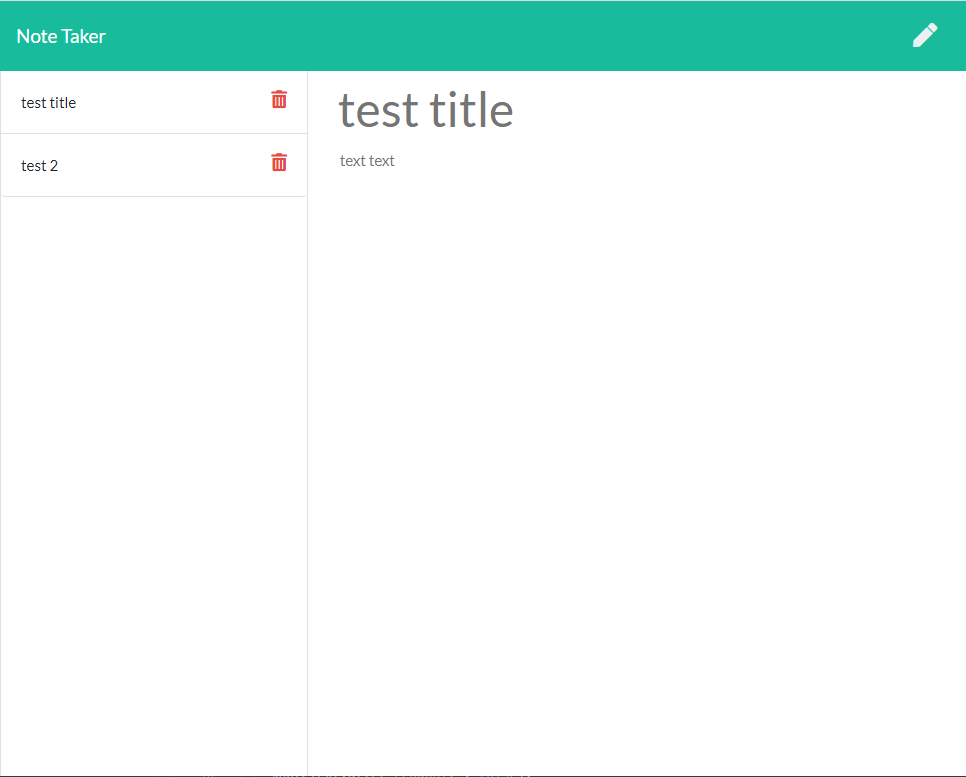

# Note Taker

## Description

This Node.js application and front end application that allows users to input title, and text of note, and updates a file called db.json. 

## Usage
execute by typing:
    node server.js

    Then launch index.html from the hosted service, and start entering notes
## Installation

Requires Express

## Credits

This program includes bootstrap from http://getbootstrap.com 
Also fontawsome from https://www.fontawesome.com
